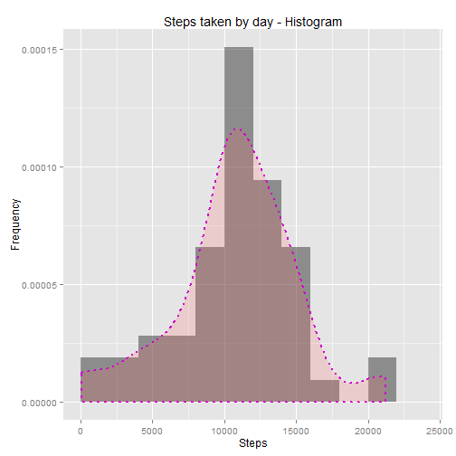
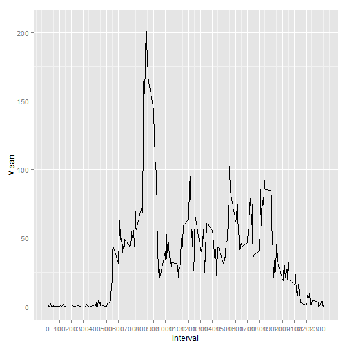
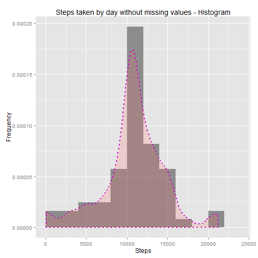
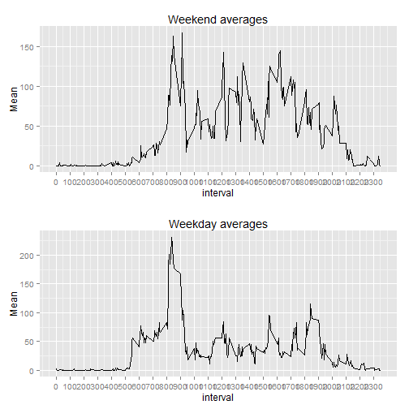

<!-- 
----
title: "Quantified Self Analysis"
author: "JasonG"
date: "Sunday, August 16, 2015"
output: html_document
----
--> 


# Quantified Self Analysis


#### Anonymous Subject, collected between the months of October and November, 2012

## Intro

This documents makes use of data from a personal activity monitoring device. The data used in this analysis corresponds to the number of steps taken by an anonymous individual at 5 minute intervals through out the day during the months of October and November of 2012.

The dataset that contains the data collected is composed by the following variables:

- **steps**: Number of steps taking in a 5-minute interval (missing values are coded as `NA`).
- **date**: The date on which the measurement was taken in *YYYY-MM-DD* format.
- **interval**: Identifier for the 5-minute interval in which measurement was taken.

The dataset is stored in a comma-separated-value (CSV) file, zipped in this repository under the name «*activity.zip*».

## Loading and preprocessing the data

The data stored in the source file is loaded by first extracting the zipped CSV file with the original dataset and then loading that dataset into a variable named `activity.raw`. From now on, the variable `activity.raw` represents a dataset with the data in its most primitive state, that is, without any transformation of filter. The following snippet shows the process used to load the data:


```r
    unzip("activity.zip")
    activity.raw <- read.csv("activity.csv")
    summary(activity.raw)
```

```
##      steps               date          interval   
##  Min.   :  0.0   2012-10-01:  288   Min.   :   0  
##  1st Qu.:  0.0   2012-10-02:  288   1st Qu.: 589  
##  Median :  0.0   2012-10-03:  288   Median :1178  
##  Mean   : 37.4   2012-10-04:  288   Mean   :1178  
##  3rd Qu.: 12.0   2012-10-05:  288   3rd Qu.:1766  
##  Max.   :806.0   2012-10-06:  288   Max.   :2355  
##  NA's   :2304    (Other)   :15840
```

## What is mean total number of steps taken per day?

In order to calculate the number of steps taken by day we will make use of the dplyr package. After loading the library, we will filter the `NA` rows, group it by date and then apply the count, sum, mean, and median calculations over the resulting set. The result of these calculations is stored in a variable named `grpByDay`, which represents the summary by date. The following code shows the process previously described:


```r
    library(dplyr)
    
    grpByDay <- activity.raw %>% 
                na.omit() %>% 
                group_by(date) %>% 
                summarise(Count = n(), Sum = sum(steps), Mean = mean(steps), Median = median(steps))
    
    grpByDay
```

```
## Source: local data frame [53 x 5]
## 
##          date Count   Sum    Mean Median
## 1  2012-10-02   288   126  0.4375      0
## 2  2012-10-03   288 11352 39.4167      0
## 3  2012-10-04   288 12116 42.0694      0
## 4  2012-10-05   288 13294 46.1597      0
## 5  2012-10-06   288 15420 53.5417      0
## 6  2012-10-07   288 11015 38.2465      0
## 7  2012-10-09   288 12811 44.4826      0
## 8  2012-10-10   288  9900 34.3750      0
## 9  2012-10-11   288 10304 35.7778      0
## 10 2012-10-12   288 17382 60.3542      0
## ..        ...   ...   ...     ...    ...
```

With the data summarized we can now plot a histogram that shows us the frequency of the steps, by day.


```r
    try(library(ggplot2), silent = TRUE)
    
    ggplot(data = grpByDay, aes(grpByDay$Sum)) + 
    geom_histogram(aes(y = ..density..), breaks = seq(0, 25000, by = 2000), alpha = 0.5) + 
    geom_density(linetype = "dotted", size = 0.75, colour = "magenta3", alpha = .2, fill = "#FF6666") + 
    labs(title = "Steps taken by day - Histogram") +
    labs(x = "Steps", y = "Frequency")
```

 

The list mean an median of steps taken per day, for all days, is shown in the next table:


```r
    knitr::kable(grpByDay %>% select(date, Mean, Median))
```


|date       |     Mean| Median|
|:----------|--------:|------:|
|2012-10-02 |  0.43750|      0|
|2012-10-03 | 39.41667|      0|
|2012-10-04 | 42.06944|      0|
|2012-10-05 | 46.15972|      0|
|2012-10-06 | 53.54167|      0|
|2012-10-07 | 38.24653|      0|
|2012-10-09 | 44.48264|      0|
|2012-10-10 | 34.37500|      0|
|2012-10-11 | 35.77778|      0|
|2012-10-12 | 60.35417|      0|
|2012-10-13 | 43.14583|      0|
|2012-10-14 | 52.42361|      0|
|2012-10-15 | 35.20486|      0|
|2012-10-16 | 52.37500|      0|
|2012-10-17 | 46.70833|      0|
|2012-10-18 | 34.91667|      0|
|2012-10-19 | 41.07292|      0|
|2012-10-20 | 36.09375|      0|
|2012-10-21 | 30.62847|      0|
|2012-10-22 | 46.73611|      0|
|2012-10-23 | 30.96528|      0|
|2012-10-24 | 29.01042|      0|
|2012-10-25 |  8.65278|      0|
|2012-10-26 | 23.53472|      0|
|2012-10-27 | 35.13542|      0|
|2012-10-28 | 39.78472|      0|
|2012-10-29 | 17.42361|      0|
|2012-10-30 | 34.09375|      0|
|2012-10-31 | 53.52083|      0|
|2012-11-02 | 36.80556|      0|
|2012-11-03 | 36.70486|      0|
|2012-11-05 | 36.24653|      0|
|2012-11-06 | 28.93750|      0|
|2012-11-07 | 44.73264|      0|
|2012-11-08 | 11.17708|      0|
|2012-11-11 | 43.77778|      0|
|2012-11-12 | 37.37847|      0|
|2012-11-13 | 25.47222|      0|
|2012-11-15 |  0.14236|      0|
|2012-11-16 | 18.89236|      0|
|2012-11-17 | 49.78819|      0|
|2012-11-18 | 52.46528|      0|
|2012-11-19 | 30.69792|      0|
|2012-11-20 | 15.52778|      0|
|2012-11-21 | 44.39931|      0|
|2012-11-22 | 70.92708|      0|
|2012-11-23 | 73.59028|      0|
|2012-11-24 | 50.27083|      0|
|2012-11-25 | 41.09028|      0|
|2012-11-26 | 38.75694|      0|
|2012-11-27 | 47.38194|      0|
|2012-11-28 | 35.35764|      0|
|2012-11-29 | 24.46875|      0|

The mean of all days is extracted as follows:


```r
    mean(activity.raw[complete.cases(activity.raw), c(1)])
```

```
## [1] 37.383
```


And the median of all days, without the missing values, can is extracted as follows:

```r
    median(activity.raw[complete.cases(activity.raw), c(1)])
```

```
## [1] 0
```

## What is the average daily activity pattern?

In order to extract the daily activity pattern, we must first group the data by intervals and extract the average number of steps for each interval. The following snippet shows us how to extract such average:


```r
    grpByInterval <- activity.raw %>% 
        na.omit() %>% 
        group_by(interval) %>% 
        summarise(Count = n(), Sum = sum(steps), Mean = mean(steps))
    
    grpByInterval
```

```
## Source: local data frame [288 x 4]
## 
##    interval Count Sum     Mean
## 1         0    53  91 1.716981
## 2         5    53  18 0.339623
## 3        10    53   7 0.132075
## 4        15    53   8 0.150943
## 5        20    53   4 0.075472
## 6        25    53 111 2.094340
## 7        30    53  28 0.528302
## 8        35    53  46 0.867925
## 9        40    53   0 0.000000
## 10       45    53  78 1.471698
## ..      ...   ... ...      ...
```

Once the daily interval is calculated, we can plot it with a time series plot, having the intervals of 5 minutes in the X-axis, and the average number of steps in the Y-axis. Notice that in order to improve readability, the tics on the X-axis have been marked each hour.


```r
    ggplot(grpByInterval, aes(interval, Mean)) + 
    geom_line() + 
    scale_x_continuous(breaks = seq(0, 2355, by = 100))
```

 

As shown in the previous plot, the subject walks more between 8:00am and 10:00am.

## Imputing missing values

The number of rows with missing values can be extracted with the following snippet:


```r
sum(is.na(activity.raw[1]))
```

```
## [1] 2304
```

In order to fill the missing values, we will assign the average value for the specific interval, previously extracted and stored in the `grpByInterval` variable. We can use a helper function to extract this value:


```r
GetStepsForInterval <- function(intervalValue){
    unlist(grpByInterval %>% filter(interval == intervalValue) %>% select(Mean))[[1]]
}
```

We can now create a new, clean, dataset, with the missing values replaced:


```r
#copy original raw with missing values
activity.tidy <- activity.raw
#clear missing cells
for(i in 1:nrow(activity.tidy)){
    isNa <- is.na(activity.tidy[i, 1])
    if(isNa){
        avgValue <- GetStepsForInterval(activity.tidy[i, 3])
        activity.tidy[i, 1] <- avgValue
    }
}
#make sure there are no more NA values in tidy dataset
sum(is.na(activity.tidy[1]))
```

```
## [1] 0
```

After filling up the gaps, we can update our previous histogram to show the shape of our new, cleaned, dataset:


```r
    grpByDay.tidy <- activity.tidy %>% 
                na.omit() %>% 
                group_by(date) %>% 
                summarise(Count = n(), Sum = sum(steps), Mean = mean(steps), Median = median(steps))
    
    grpByDay.tidy
```

```
## Source: local data frame [61 x 5]
## 
##          date Count   Sum    Mean Median
## 1  2012-10-01   288 10766 37.3826 34.113
## 2  2012-10-02   288   126  0.4375  0.000
## 3  2012-10-03   288 11352 39.4167  0.000
## 4  2012-10-04   288 12116 42.0694  0.000
## 5  2012-10-05   288 13294 46.1597  0.000
## 6  2012-10-06   288 15420 53.5417  0.000
## 7  2012-10-07   288 11015 38.2465  0.000
## 8  2012-10-08   288 10766 37.3826 34.113
## 9  2012-10-09   288 12811 44.4826  0.000
## 10 2012-10-10   288  9900 34.3750  0.000
## ..        ...   ...   ...     ...    ...
```

```r
    try(library(ggplot2), silent = TRUE)
    
    ggplot(data = grpByDay.tidy, aes(grpByDay.tidy$Sum)) + 
    geom_histogram(aes(y = ..density..), breaks = seq(0, 25000, by = 2000), alpha = 0.5) + 
    geom_density(linetype = "dotted", size = 0.75, colour = "magenta3", alpha = .2, fill = "#FF6666") + 
    labs(title = "Steps taken by day without missing values - Histogram") +
    labs(x = "Steps", y = "Frequency")
```

 

As we can see, the distribution and frequency remains the same, although the data seems to be more complete.

## Are there differences in activity patterns between weekdays and weekends?

To compare the steps frequency between weekdays and weekends we will first mutate our tidy set to include another variable, named `isWeekend`, that will tell us if the specific observation date corresponds to a weekend day or not. This is accomplished with the following script:


```r
activity.tidy <- activity.tidy  %>%
    mutate(obsDate = as.Date(as.character(date), "%Y-%m-%d"),
           isWeekend = grepl('^S', weekdays(obsDate)))

head(activity.tidy, 10)
```

```
##       steps       date interval    obsDate isWeekend
## 1  1.716981 2012-10-01        0 2012-10-01     FALSE
## 2  0.339623 2012-10-01        5 2012-10-01     FALSE
## 3  0.132075 2012-10-01       10 2012-10-01     FALSE
## 4  0.150943 2012-10-01       15 2012-10-01     FALSE
## 5  0.075472 2012-10-01       20 2012-10-01     FALSE
## 6  2.094340 2012-10-01       25 2012-10-01     FALSE
## 7  0.528302 2012-10-01       30 2012-10-01     FALSE
## 8  0.867925 2012-10-01       35 2012-10-01     FALSE
## 9  0.000000 2012-10-01       40 2012-10-01     FALSE
## 10 1.471698 2012-10-01       45 2012-10-01     FALSE
```

From here, we can plot two panels and compare the difference on those dates by intervals. First, we will extract the interval averages for the week days, and then, the interval averages for the weekends:


```r
#first, we get weekday averages
weekdays.averages <- activity.tidy %>% 
    filter(isWeekend == FALSE) %>%
    group_by(interval) %>% 
    summarise(Mean = mean(steps))

#then, we get weekend averages
weekend.averages <- activity.tidy %>% 
    filter(isWeekend == TRUE) %>%
    group_by(interval) %>% 
    summarise(Mean = mean(steps))
```

Once the averages are calculated, we can plot the different patterns for weekdays vs weekends, by intervals, in a single panel:


```r
#first we create a multiplot function:
# Multiple plot function
#
# ggplot objects can be passed in ..., or to plotlist (as a list of ggplot objects)
# - cols:   Number of columns in layout
# - layout: A matrix specifying the layout. If present, 'cols' is ignored.
#
# If the layout is something like matrix(c(1,2,3,3), nrow=2, byrow=TRUE),
# then plot 1 will go in the upper left, 2 will go in the upper right, and
# 3 will go all the way across the bottom.
#
multiplot <- function(..., plotlist=NULL, file, cols=1, layout=NULL) {
  library(grid)

  # Make a list from the ... arguments and plotlist
  plots <- c(list(...), plotlist)

  numPlots = length(plots)

  # If layout is NULL, then use 'cols' to determine layout
  if (is.null(layout)) {
    # Make the panel
    # ncol: Number of columns of plots
    # nrow: Number of rows needed, calculated from # of cols
    layout <- matrix(seq(1, cols * ceiling(numPlots/cols)),
                    ncol = cols, nrow = ceiling(numPlots/cols))
  }

 if (numPlots==1) {
    print(plots[[1]])

  } else {
    # Set up the page
    grid.newpage()
    pushViewport(viewport(layout = grid.layout(nrow(layout), ncol(layout))))

    # Make each plot, in the correct location
    for (i in 1:numPlots) {
      # Get the i,j matrix positions of the regions that contain this subplot
      matchidx <- as.data.frame(which(layout == i, arr.ind = TRUE))

      print(plots[[i]], vp = viewport(layout.pos.row = matchidx$row,
                                      layout.pos.col = matchidx$col))
    }
  }
}

weekdayPlot <- ggplot(weekdays.averages, aes(interval, Mean)) + 
               geom_line() + 
               labs(title = "Weekday averages") +
               scale_x_continuous(breaks = seq(0, 2355, by = 100))

weekendPlot <- ggplot(weekend.averages, aes(interval, Mean)) + 
               geom_line() + 
               labs(title = "Weekend averages") +
               scale_x_continuous(breaks = seq(0, 2355, by = 100))

multiplot(weekendPlot, weekdayPlot, cols = 1)
```

 


